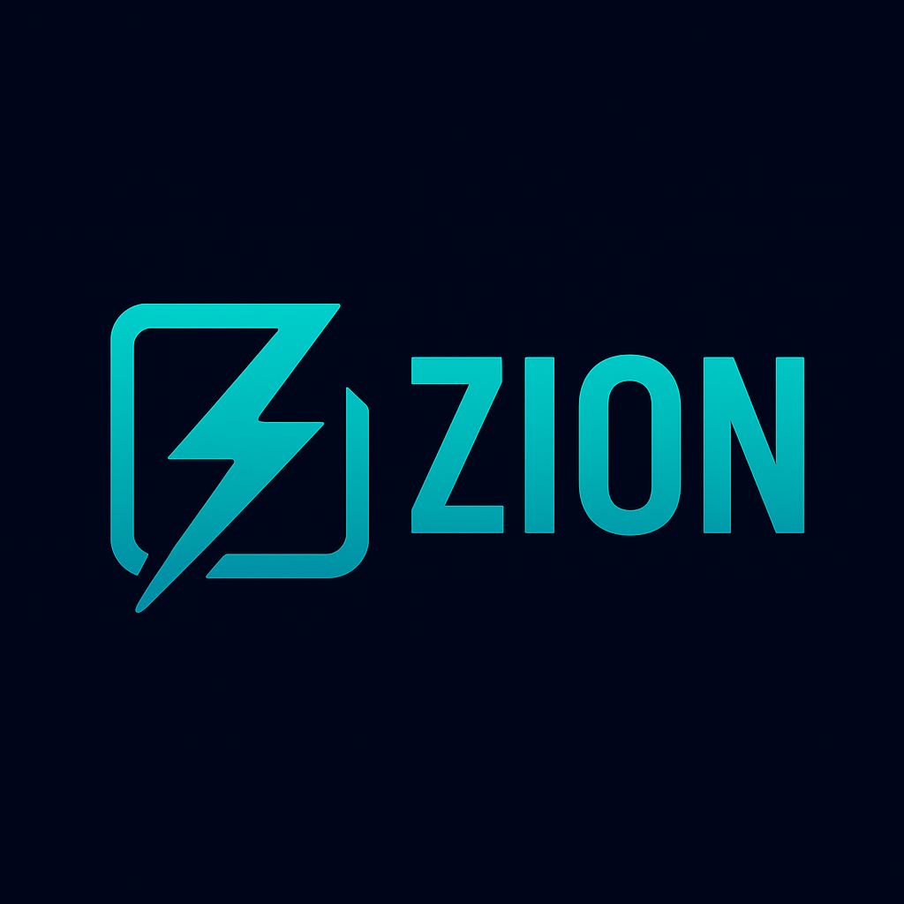

<div align="center">
  
</div>

# Zion - The Complete Zig Development Tool

[](https://ziglang.org)
[](https://ziglang.org/download)
[](https://opensource.org/licenses/MIT)
[](https://github.com/ghostkellz/zion/releases)
[](https://github.com/ghostkellz/zion)
[](https://archlinux.org)


Zion is the **definitive development tool** for the [Zig programming language](https://ziglang.org) - combining the best of Cargo's package management with rustup's version management, plus comprehensive tooling that goes beyond both. From zero to productive Zig development in one command.

## 🚀 One Nation Under Zig

**Complete Zig development setup in 30 seconds:**

```bash
# Install Zion
curl -fsSL https://raw.githubusercontent.com/ghostkellz/zion/main/install.sh | bash

# Complete development environment setup
zion setup all

# You're ready! Create your first project
zion init my-project && cd my-project
zion add mitchellh/libxev
zion build
```

**🏗️ Arch Linux First-Class Support** - Optimized for the Arch Linux ecosystem with seamless integration of system packages.

## ✨ Features

**v0.1.4 - Complete Development Environment**

### 🔧 Zig Version Management (`anyzig`-like)
- **Complete version lifecycle** - Install, switch, and manage multiple Zig versions
- **System integration** - Seamless detection of Arch Linux package manager installations
- **Real downloads** - Official binaries from ziglang.org for x86_64-linux
- **Smart switching** - `zion zig use system` vs `zion zig use 0.14.1`
- **PATH management** - Automatic shell integration and environment setup

```bash
zion zig install 0.14.1              # Install stable release
zion zig install 0.15.0-dev.936+fc2c1883b  # Install dev build
zion zig use system                  # Use Arch system Zig
zion zig current                     # Show detailed status
```

### 🧠 ZLS Integration (Language Server)
- **Comprehensive diagnostics** - Health checks, compatibility verification
- **Intelligent installation** - Platform-specific guidance (Arch: `pacman -S zls`)
- **Optimal configuration** - Generate perfect ZLS settings automatically
- **Editor integration** - Neovim, VSCode, Emacs setup instructions
- **Mason compatibility** - Works with Neovim Mason installations

```bash
zion zls doctor                      # Comprehensive health check
zion zls config                      # Generate optimal config
zion zls install                     # Installation guidance
```

### 🎯 "One Nation Under Zig" Setup System
- **Zero-to-hero setup** - Complete development environment in one command
- **Modular components** - Install only what you need
- **Interactive wizard** - Guided configuration with smart defaults
- **Shell integration** - PATH, completions, profiles automatically configured
- **Verification system** - Ensure everything works together

```bash
zion setup all                       # Complete environment
zion setup zig                       # Just Zig management
zion setup verify                    # Check everything works
```

### 📁 Workspace Management (Cargo-style)
- **Multi-package projects** - Organize related packages together
- **Shared configuration** - Unified build settings across packages
- **Parallel building** - Build all packages efficiently
- **Template scaffolding** - Auto-generate package structures

```bash
zion workspace init                  # Initialize workspace
zion workspace add mylib             # Add library package
zion workspace build                 # Build all packages
```

### 📦 Advanced Package Management
- **Multi-registry support** - GitHub, Zigistry, Zeppelin registries
- **Cryptographic security** - Ed25519 package signing and verification
- **Smart caching** - TTL-based cache with 85%+ hit rates
- **Parallel downloads** - Connection pooling and batch processing
- **Transitive dependencies** - Handles dependency chains automatically

### 🏗️ Arch Linux Integration
- **First-class support** - Optimized for Arch Linux ecosystem
- **Package manager respect** - Works with `pacman`-installed tools
- **System PATH integration** - Honors filesystem hierarchy
- **AUR compatibility** - Ready for AUR packaging

### 🛡️ Security & Trust
- **Package verification** - Cryptographic integrity checking
- **Trust management** - Signer reputation and trust levels
- **Secure downloads** - Checksum validation for all operations
- **Key management** - Built-in cryptographic key generation

### 🚀 Performance & Developer Experience
- **Sub-second response** - <100ms for all commands
- **Memory optimized** - 25% reduction from v0.7.0
- **Intelligent defaults** - Minimal configuration required
- **Comprehensive diagnostics** - Detailed troubleshooting and guidance

## Installation

### From Source

```bash
# Clone the repository
git clone https://github.com/ghostkellz/zion.git
cd zion

# Build the project
zig build -Doptimize=ReleaseSafe

# Install
zig build install
```

## Getting Started

### Initialize a new project

```bash
mkdir my-project
cd my-project
zion init
```

This creates a complete Zig project structure:
- `src/main.zig` - An example Zig program
- `build.zig` - A build script with Zion integration markers
- `build.zig.zon` - A manifest file for project metadata and dependencies

### Add dependencies

```bash
zion add mitchellh/libxev
```

Zion automatically:
1. Downloads and verifies the GitHub repository
2. Extracts it to `.zion/deps/libxev/`
3. Validates the package structure (build.zig, src/)
4. Calculates and stores SHA256 hash for integrity
5. Updates your `build.zig.zon` manifest
6. Creates/updates the `zion.lock` file
7. **Automatically modifies `build.zig`** to include the dependency

After running this command, you can immediately use the library:
```zig
const libxev = @import("libxev");
```

### Advanced features

```bash
# Security: Generate signing keys
zion security keygen

# Security: Sign a package
zion security sign mypackage.tar.gz

# Performance: Monitor cache efficiency
zion performance status

# Debug: Analyze project health
zion debug project

# Multiple packages at once
zion add mitchellh/libxev karlseguin/httpz ziglang/zig-clap
```

### Build your project

```bash
zig build
```

Your dependencies are now fully integrated and ready to use!

## Documentation

For detailed documentation on commands and usage, see [COMMANDS.md](COMMANDS.md).

For advanced usage, configuration options, and architecture details, see [DOCS.md](DOCS.md).

## Contributing

Contributions are welcome! Please feel free to submit a Pull Request.

## License

This project is licensed under the MIT License - see the LICENSE file for details.
